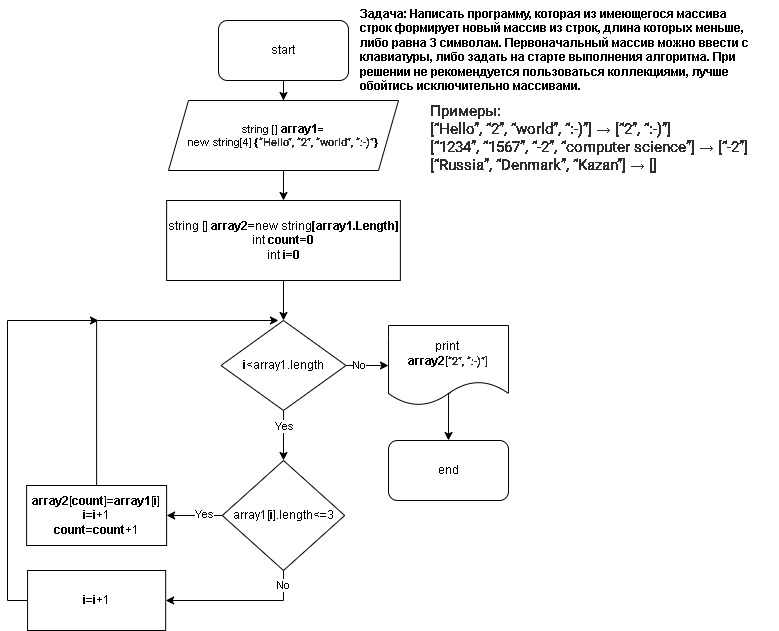

# * *BlockSchema.png* Файл изображения с блок схемой решения*
# * В папке *Code_of_solution* находится решение через консоль*

# **Задача:**

 ### **Написать программу, которая из имеющегося массива строк формирует новый массив из строк, длина которых меньше, либо равна 3 символам. Первоначальный массив можно ввести с клавиатуры, либо задать на старте выполнения алгоритма. При решении не рекомендуется пользоваться коллекциями, лучше обойтись исключительно массивами.**

## **Решение:**

> * 1. Объявляем два массива: Исходный `array1`  и  второй такой же длины `array2`.
> * 2. Создаем переменную `count`
> * 3. Потом создаем цикл `for` соразмерный длине массива.
> * 4. Внутри цикла делаем проверку условия ( <=3 ), если условие выполняется элемент первого массива `array1` заносится в `count` элемент второго массива `array2`.
> * 5. После присвоения элемента переменная `count` увеличивается на 1 и возвращается к циклу `for` в котором `i` увеличивается на 1. И так проверяется до конца.

#
